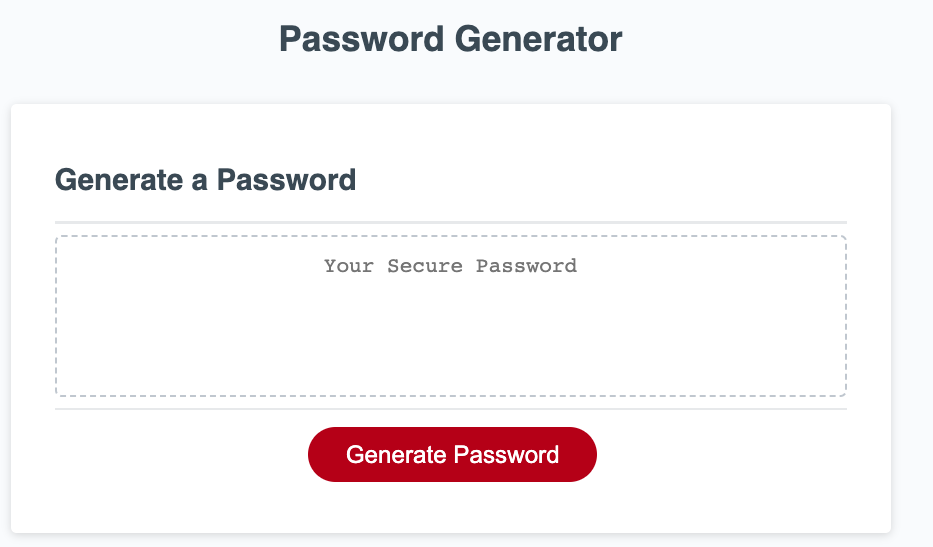

# <Generate Secure-Passphrase>

## Description

By modifying the given starter code, I have created a browser-based application that allows users to generate randomized passwords based on their chosen criteria. The application utilizes JavaScript to power its functionalities and can be accessed through a web browser.

## Installation
It is a browser-based application.
The code base is as follow: 
* index.html: is the structure of the webpage.
* Develop/style.css provide style to the webpage.
* Develop/script.js: JavaScript provide the interactivity of the app.

## Usage

Please feel free to use this code as starter-code for your own webpage. you alwase can modify the HTML and CSS and JavaScript files to customize the design.

Visit the [deployed webpage](https://bazrahimi.github.io/secure-passphrase/) to see the live version.

<<<<<<< HEAD

=======

>>>>>>> 486bbf2f75197e4ed70e2553bc6c62a8dc9b6cb5

## Credits

[https://github.com/coding-boot-camp/urban-octo-telegram.git](https://git.bootcampcontent.com/Monash-University/MONU-VIRT-FSF-PT-05-2023-U-LOLC.git)

[https://applications.zoom.us/lti/rich/home/recording/detail](https://applications.zoom.us/lti/rich/home/recording/detail)
[https://git.bootcampcontent.com/Monash-University/MONU-VIRT-FSF-PT-05-2023-U-LOLC
](https://applications.zoom.us/lti/rich/home/recording/detail)
## License

The code base is released under the MIT Licese, but feel free to use, modify, and distribute the code.
